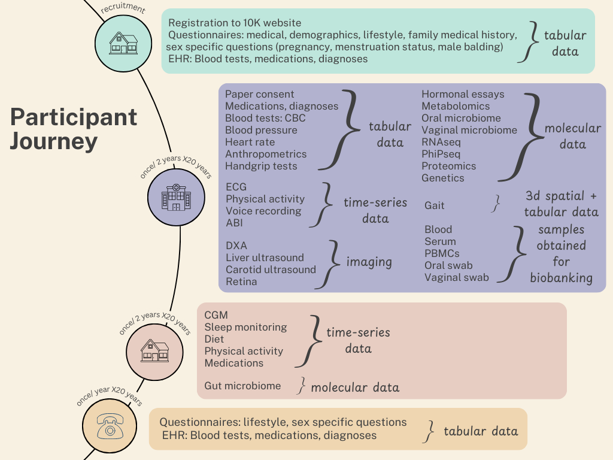

# Get to Know the HPP

The Human Phenotype Project (HPP) is a comprehensive, longitudinal cohort study and biobank involving approximately 28,000 participants, with over 13,000 having completed their initial visit. The project aims to identify novel molecular signatures with diagnostic, prognostic, and therapeutic value, and to develop AI-based predictive models for disease onset and progression.

The HPP provides a diverse range of data types to support advanced research and AI-based predictive modeling. These include:

1. **Tabular Data**: Comprehensive datasets from questionnaires and electronic health records (EHR), covering medical history, demographic information, lifestyle and nutritional habits, family history, blood tests, medications, and diagnoses.

2. **Molecular Data**: Detailed molecular profiling, including metabolomics, genetics, transcriptomics (RNA sequencing), proteomics, and microbiome analyses (oral, vaginal, and gut).

3. **Time-Series Data**: Continuous monitoring data such as glucose levels, sleep patterns, physical activity, diet tracking, and voice recordings, offering dynamic insights over time.

4. **Imaging Data**: High-resolution medical imaging modalities, including dual-energy X-ray absorptiometry (DXA), ultrasounds, electrocardiograms (ECG), and retinal imaging, for structural and functional assessments.

5. **3D Spatial Data and Biobanked Samples**: Physical samples such as blood, serum, peripheral blood mononuclear cells (PBMCs), and swabs, stored for further biological and molecular exploration.

This rich, multimodal dataset enables unprecedented insights into health and disease, supporting the development of personalized medicine and predictive AI models. 

