# Trusted Research Environment User Guide - Applicable for version 6.2.1

Trusted Research Environment (TRE) is a cloud solution that provides secure access to data, tooling, and compute power that researchers need. Researchers can focus on achieving research missions and completing essential work in minutes in a trusted research environment.

# Getting Started

## Sign Up

Use this section if this is your first time connecting to the system.

1. Open your browser and navigate to TRE URL.
1. Click on the **Sign up** link.

3. Fill out your **Username** (email address), **Name**, **Family name** and pick a **Password.**

4. Click the **Sign up** button.

## Login

1. Open your browser and navigate to TRE URL.
1. Type in your **Username** (the email you used to sign up) and your **Password.**
1. Click the **Sign In** button.

## User Interface

**Dashboard** - Displays AWS charges over the past 30 days

**SSH Keys** - SSH Keys for EC2 authorization

**Workspaces** - The combination of a study with a compute

# Studies - Data sets saved in Amazon S3

## Personal Study
1. Click on **Create Study**
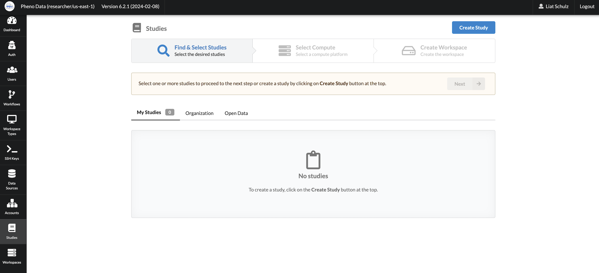
1. Fill up all the fields and press **Create Study** myStudy for personal and Organziation study for Org Studies

1. Study Created and ready to use 
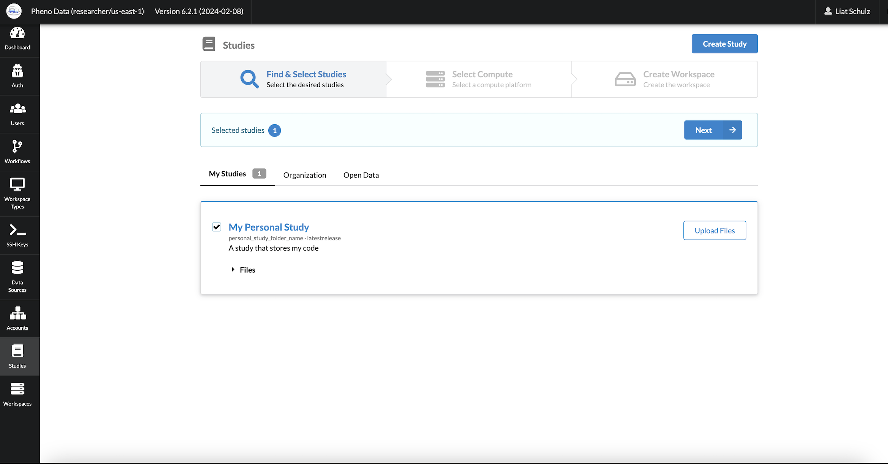

## Organizational Study
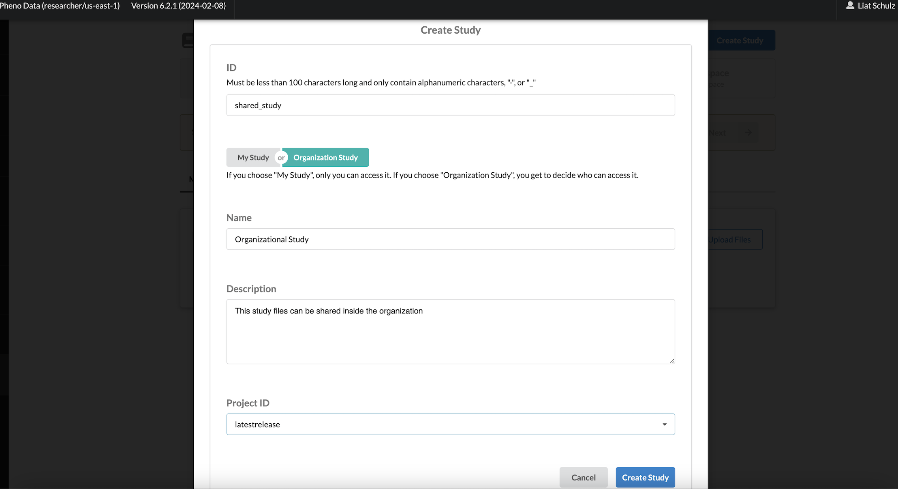

# Using Trusted Research Environment

## Launching a new Research Environment

A user can select a Study or multiple Studies and launch a Workspace to access and analyze data. To launch a Research Environment, follow these steps:

1. In the portal navigate to the **Studies** page using the menu on the left.
1. Select the Studies to be attached to the new Workspace.
1. Once you have selected all the Studies you want, click the **Next** button.

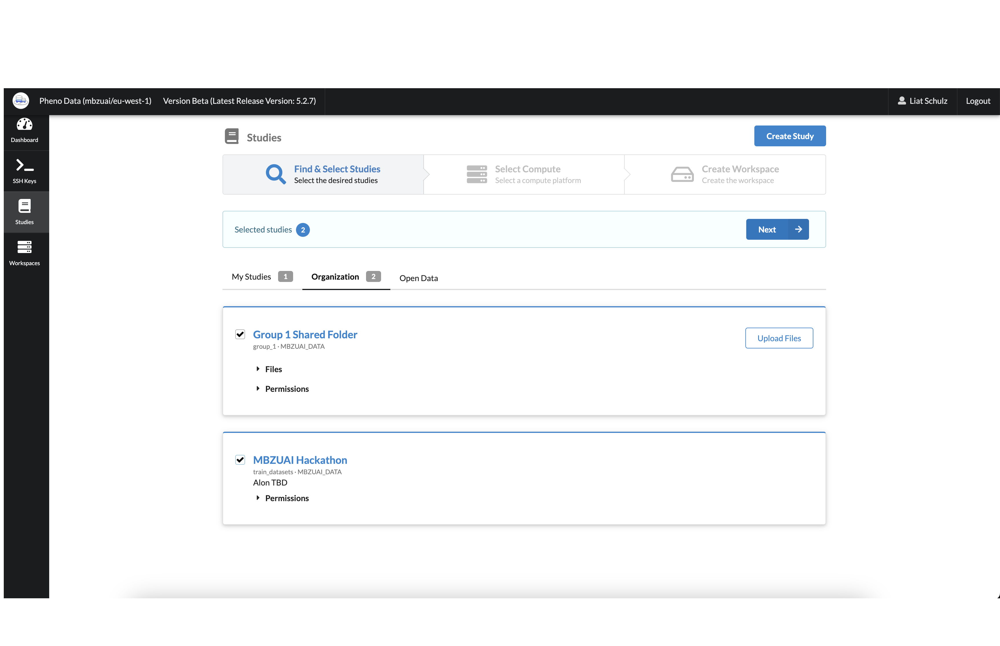

4. Choose the type of Workspace you want and click the **Next** button.

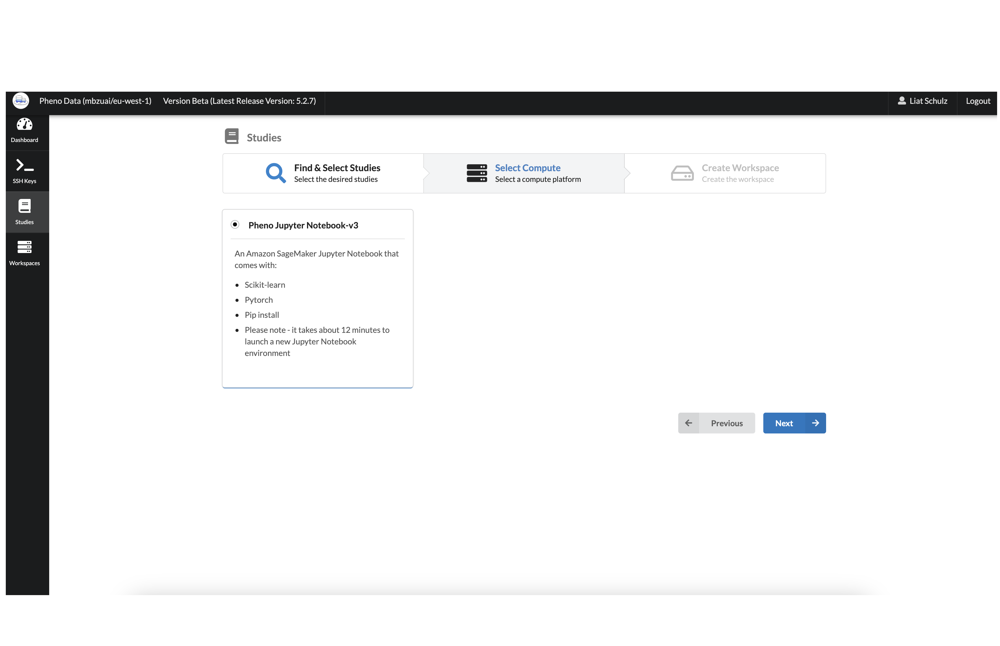

5. Fill in the Workspace **Name** field. 
5. Select your project in the **Project ID** drop down field.
5. Select the **Configuration** type according to your needs.
8. Type a description for the Workspace in the **Description** field.
9. Click the **Create Research Workspace** button.

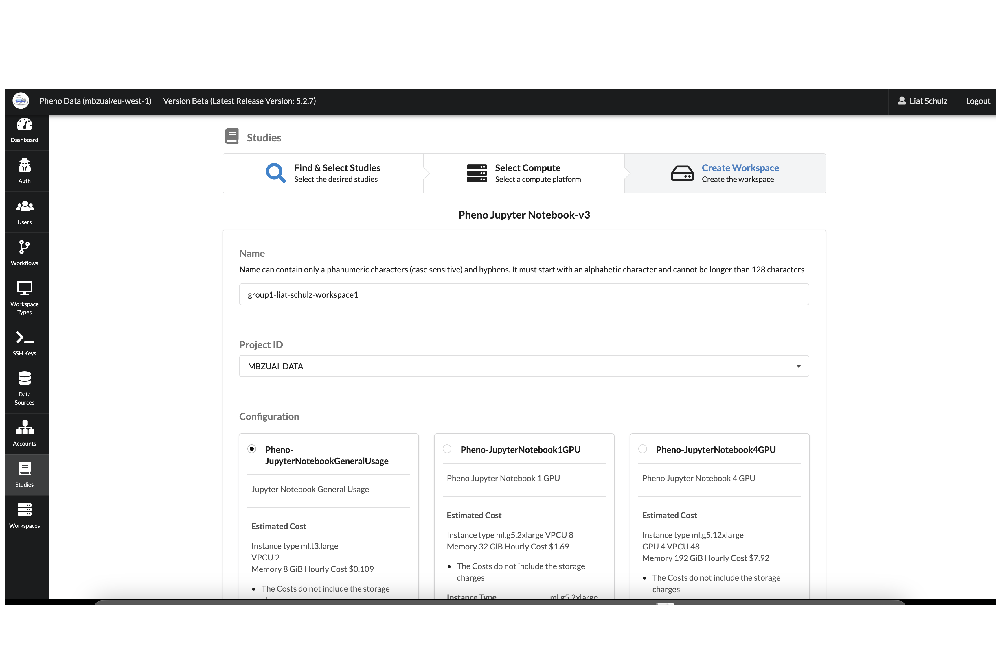
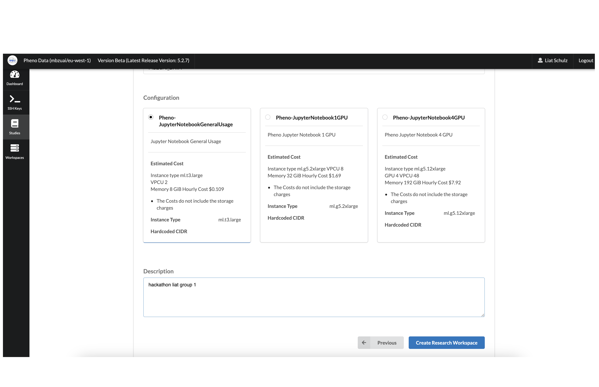

This will deploy the new Workspace and attach the Studies that were selected. 

You will automatically be redirected to the Workspaces tab on the portal.

Wait for the workspace to be **Available**.

## Connecting to EC2

1. In the portal navigate to the **Workspaces** page using the menu on the left.
1. Click on the **Connections** button, below the **Workspace** name.

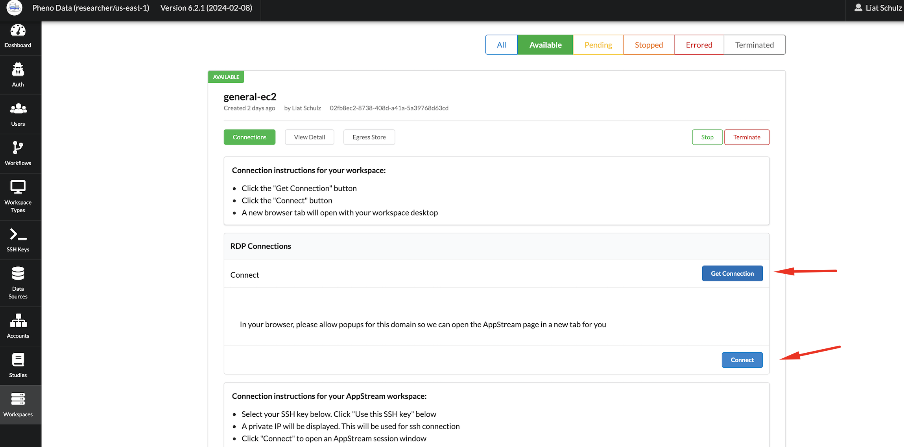

## Connecting to an Existing Research Environment

1. In the portal navigate to the **Workspaces** page using the menu on the left.
1. Click on the **Connections** button, below the **Workspace** name.

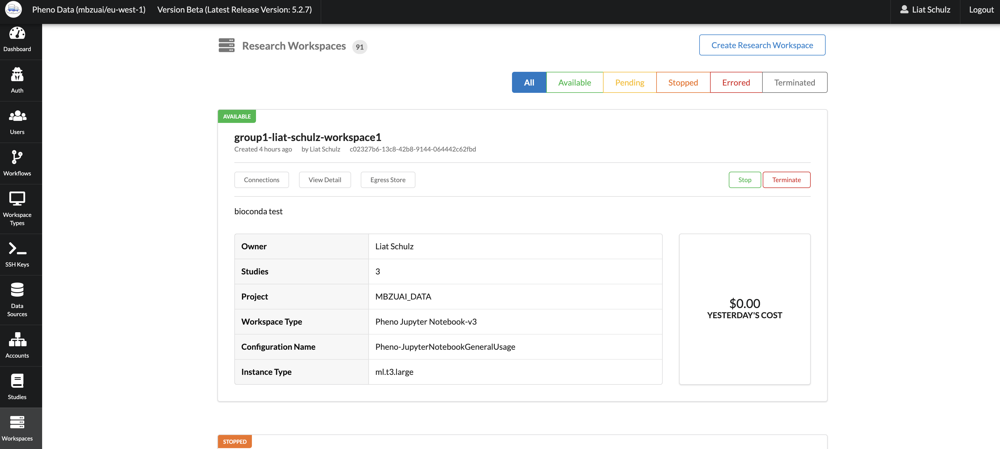

3. Click on the **Generate URL** button on the right, under HTTP Connections.
4. Click **Connect.**

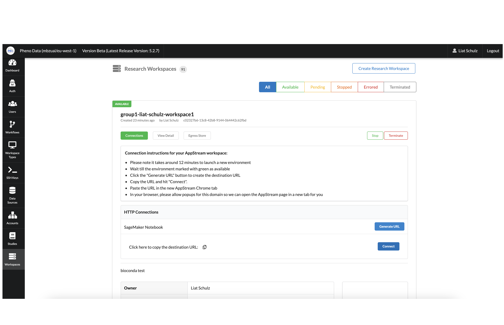

5. Wait for the system to load.

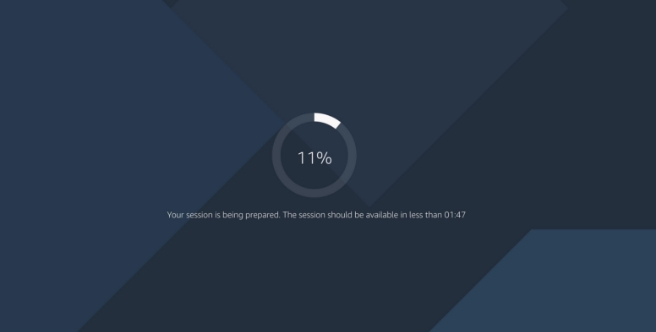

It will now open the browser with the data and the tools to start working.
It will open in Firefox automatically if the workspace created in a Notebook, or Remmina Client(Remote) in case it created in EC2. 
So you can do the following:

## Installing Python Packages

1. Connect to the Research Environment and open your Jupyter Notebook (See: Connect to an Existing Research Environment)
2. Click on Open JupyterLab on the top right.

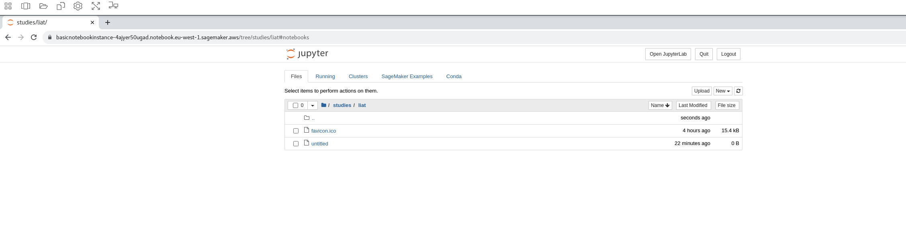
3. Open a new Jupyter notebook.

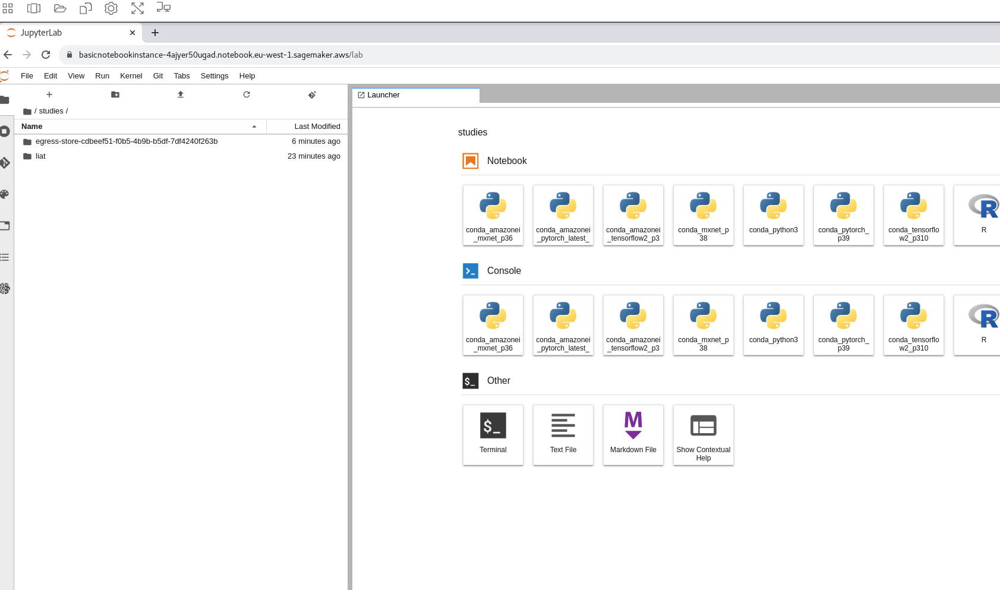

4. Inside the one of the notebook cells, type `!pip3 install <package name>`.

### For any questions or help please contact: [support@pheno.ai](support@pheno.ai)

## Attach Files to a Research Environment

1. Navigate to the **Studies** page using the menu on the left.
1. Find the Study you want to attach files to and click **Upload Files** on the right.
1. You can upload files either by dragging and dropping, or by clicking the **Upload Files** or **Upload Folder** button.

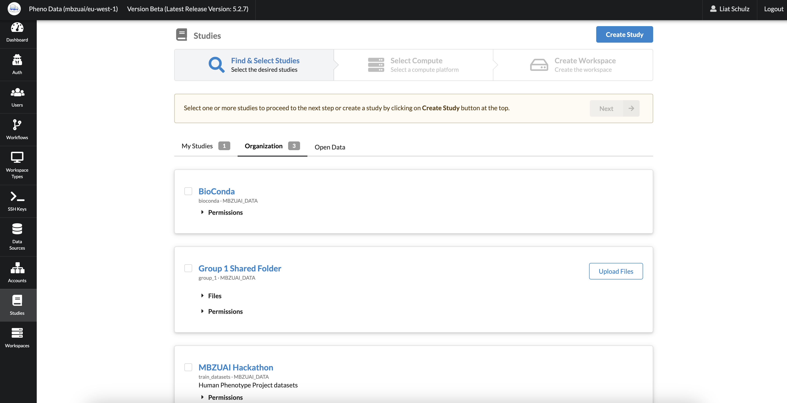

## Collaborating and Sharing Data Between Environments

To share code with peers, make sure to include a common organizational **Study** when creating your workspace.

Inside the workspace, the shared folder will be located at `/home/ec2-user/studies/<study name>`.

In Jupyter’s file explorer, this will be under `studies/<study name>`.

Files included in this folder will be shared with researchers in your **Organization**. 

When saving code and temporary data, we recommend saving code in outside of the studies folder, and only move them to the shared folder once you’de like to share amongst your peers. 

## Terminating a Research Environment

When you no longer need a Research Environment you can terminate it. Follow these steps:

1. In the portal navigate to the **Workspaces** page using the menu on the left.
1. In the list of Workspaces, find the Workspace that you want to terminate.
1. Click on the **Terminate** button, the Workspace must be in the **Ready** state to terminate it.

# Tools Installation

## Docker usage

### Docker pull
docker registry: https://gallery.ecr.aws/ \
Use the following code  `docker pull \<accountID\>.dkr.ecr.\<aws-region\>.amazonaws.com/ecr-public/\<Change to your library\>`
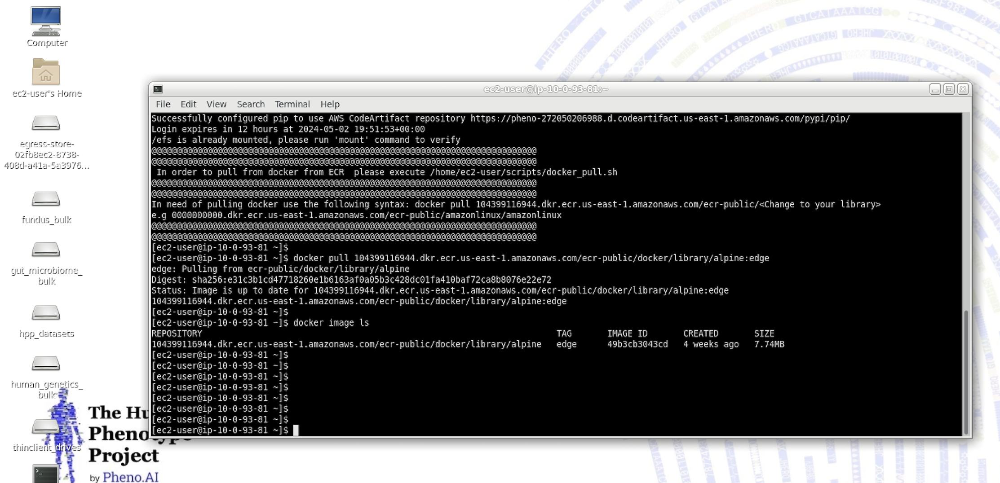

### Docker run
Use the image you have under docker image ls \
e.g  `docker run -it --rm \<accountID\>.dkr.ecr.\<aws-region\>.amazonaws.com/ecr-public/docker/library/alpine:edge`
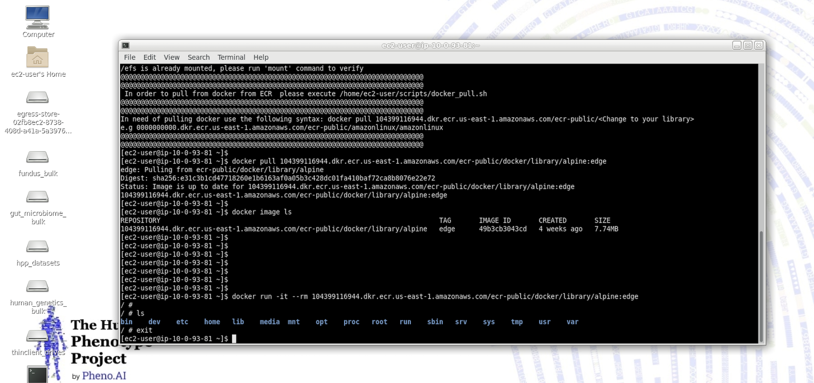
