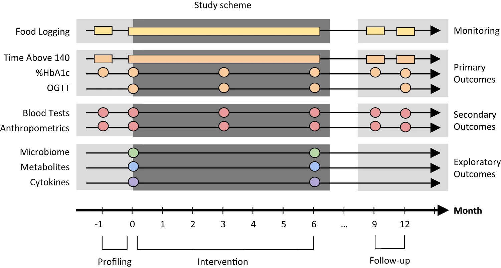

Shoer S, Shilo S, Godneva A, Ben-Yacov O, Rein M, Wolf B, Lotan-Pompan M, Bar N, Weiss E, Houri-Haddad Y, Pilpel Y, Weinberger A, Segal E, [*Nature Communications*](http://dx.doi.org/10.1038/s41467-023-41042-x)

## Paper summary

Diabetes and associated comorbidities are a global health threat on the rise. We conducted a six-month dietary intervention in pre-diabetic individuals (NCT03222791), to mitigate the hyperglycemia and enhance metabolic health. The current work explores early diabetes markers in the 200 individuals who completed the trial. We find 166 of 2,803 measured features, including oral and gut microbial species and pathways, serum metabolites and cytokines, show significant change in response to a personalized postprandial glucose-targeting diet or the standard of care Mediterranean diet. These changes include established markers of hyperglycemia as well as novel features that can now be investigated as potential therapeutic targets. Our results indicate the microbiome mediates the effect of diet on glycemic, metabolic and immune measurements, with gut microbiome compositional change explaining 12.25% of serum metabolites variance. Although the gut microbiome displays greater compositional changes compared to the oral microbiome, the oral microbiome demonstrates more changes at the genetic level, with trends dependent on environmental richness and species prevalence in the population. In conclusion, our study shows dietary interventions can affect the microbiome, cardiometabolic profile and immune response of the host, and that these factors are well associated with each other, and can be harnessed for new therapeutic modalities.

