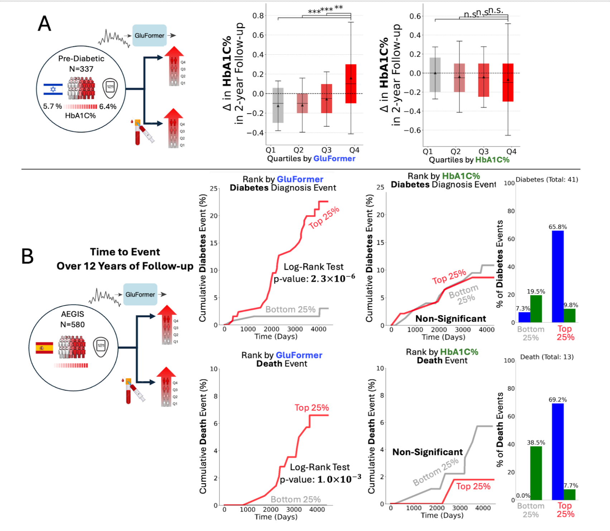
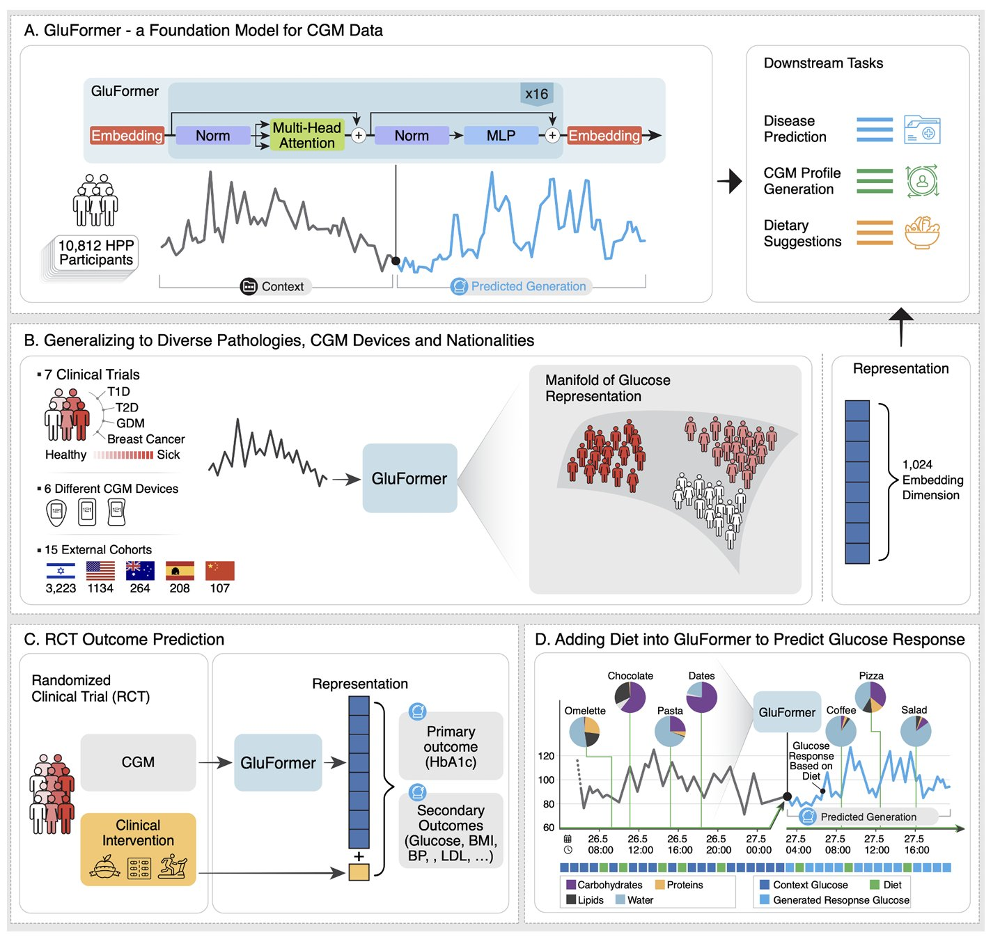

Lutsker G, Sapir G, Shilo S, Merino J, Godneva A, Greenfield J, Samocha-Bonet D, Dhir R, Gude F, Mannor S, Meirom E, Chechik G, Rossman H, Segal E, [*arxiv*](https://arxiv.org/abs/2408.11876)

[//]: # (table_of_contents is not supported)

## Paper summary

The [paper](http://arxiv.org/abs/2408.11876) describes the GluFormer model that was developed based on CGM data from 10,812 non-diabetic individuals from the HPP dataset. The AI model is from the class of transformer-based generative models, similar to ChatGPT (GPT = Generative, Pretrained, Transformer). For each glucose measurement, it provides a prediction for the next point in time. The model offers insights into metabolic health, predicting health outcomes 4 years in advance, outperforming state-of-the-art CGM analysis tools. It can be used for different downstream tasks, for example to forecast outcomes of clinical trials or to simulate glucose response to diet. 
Most important numbers: 

- In a longitudinal study of 580 adults with CGM data and 12-year follow-up, GluFormer identifies individuals at elevated risk of developing diabetes more effectively than blood HbA1C%, capturing 66% of all new-onset diabetes diagnoses in the top quartile versus 7% in the bottom quartile. 

- Similarly, 69% of cardiovascular-death events occurred in the top quartile with none in the bottom quartile, demonstrating powerful risk stratification beyond traditional glycemic metrics.

 