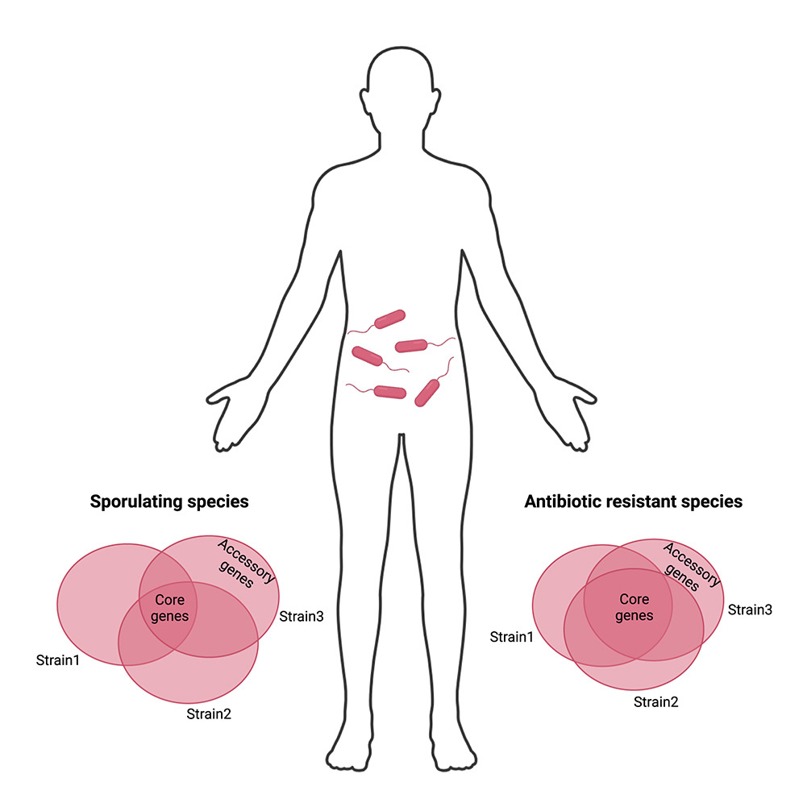

Shoer S, Reicher L, Zhao C, Pollard K, Pilpel Y, Segal E, [*Cell Host & Microbe*](https://doi.org/10.1016/j.chom.2024.08.017)

 

## Paper summary

The genetic diversity of the gut microbiota has a central role in host health. Here, we created pangenomes for 728 human gut prokaryotic species, quadrupling the genes of strain-specific genomes. Each of these species has a core set of a thousand genes, differing even between closely related species, and an accessory set of genes unique to the different strains. Functional analysis shows high strain variability associates with sporulation, whereas low variability is linked with antibiotic resistance. We further map the antibiotic resistome across the human gut population and find 237 cases of extreme resistance even to last-resort antibiotics, with a predominance among Enterobacteriaceae. Lastly, the presence of specific genes in the microbiota relates to host age and sex. Our study underscores the genetic complexity of the human gut microbiota, emphasizing its significant implications for host health. The pangenomes and antibiotic resistance map constitute a valuable resource for further research.

