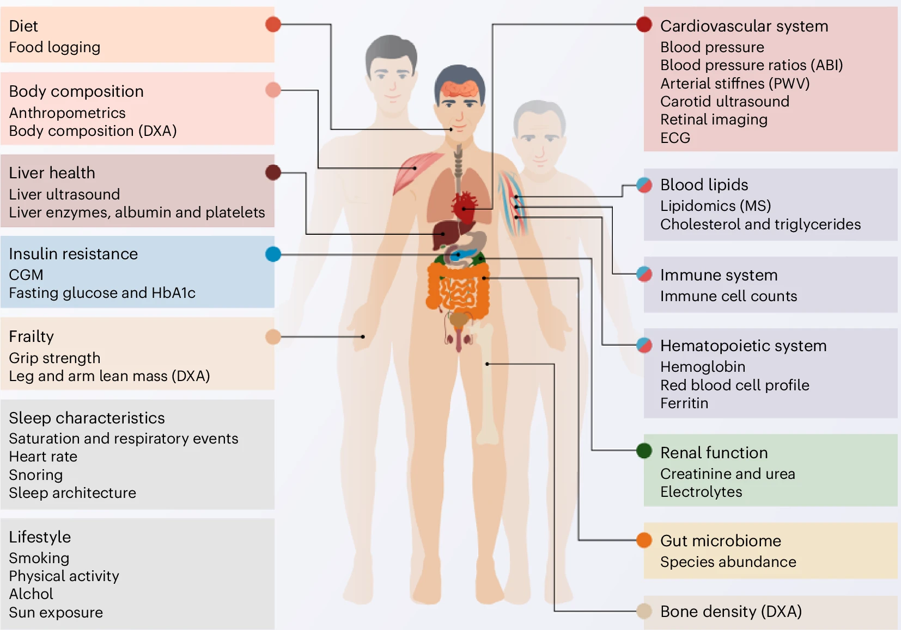

Reicher L, Bar N, Godneva A, Reisner Y, Zahavi L, Shahaf N, Dhir R, Weinberger A, Segal E, [*Nature Aging*](https://doi.org/10.1038/s43587-024-00734-9)

## Paper summary

### TL;DR Summary

💡 

	- Researchers used data from the Human Phenotype Project to create sex-specific biological age (BA) models. 

	- Findings showed that biological systems age differently between sexes; BA models based on bone density and cardiovascular markers performed better in women, potentially due effects of menopause.

	- This study supports personalized prevention strategies, emphasizing the need for sex-specific interventions in aging.

### Full Summary

This study analyzed data from the Human Phenotype Project - a deeply phenotyped cohort of 10,000 individuals aged 40-70 years to develop biological age (BA) models that reveal distinct aging patterns across various physiological systems. 

By leveraging multiomic, clinical, and environmental data collected in the Human Phenotype Project, the researchers devised sex-specific machine learning models to estimate BA and its relationship to age-related diseases. The findings revealed notable differences in aging dynamics between males and females, with distinct BA scores correlating with age-related health conditions. Notably, BA scores provided insights into sex-specific risks, such as a higher incidence of osteoporosis in aging women, emphasizing the potential role of menopause in accelerating certain aging processes.

The study also highlighted that biological systems age differently between men and women, as evidenced by the variability of biological aging models based on bone density, blood lipids, and cardiovascular function. These models demonstrated better performance among women, potentially reflecting the effects of menopause. The research underscores the significance of considering sex as a biological variable in aging studies and its impact on clinical outcomes. These findings offer a holistic view of aging, which can drive personalized medical prevention strategies and the development of sex-specific interventions to mitigate the impact of aging-related diseases, ultimately contributing to healthier aging.

 