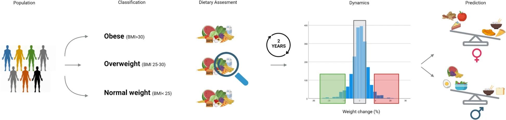

Rein M, Elkan M, Godneva A, Dolev N, Segal E, [*BMC Medicine*](https://doi.org/10.1186/s12916-024-03730-3)

## Paper summary 

The study leverages a unique dataset to explore the relationship between diet and obesity management, focusing on gender-specific dietary impacts. 

The study analyzed how different food categories influence body mass index (BMI) at baseline and weight change over time.

The authors discovered that dietary habits and their effects on weight management vary significantly by sex. In men, weight loss was associated with increased intake of animal-based proteins, whereas in women, it correlated with a higher consumption of plant-based fats. These findings suggest that personalized dietary interventions considering gender-specific needs could enhance obesity management effectiveness. This research underscores the value of our detailed diet logging data in developing targeted nutritional strategies.

