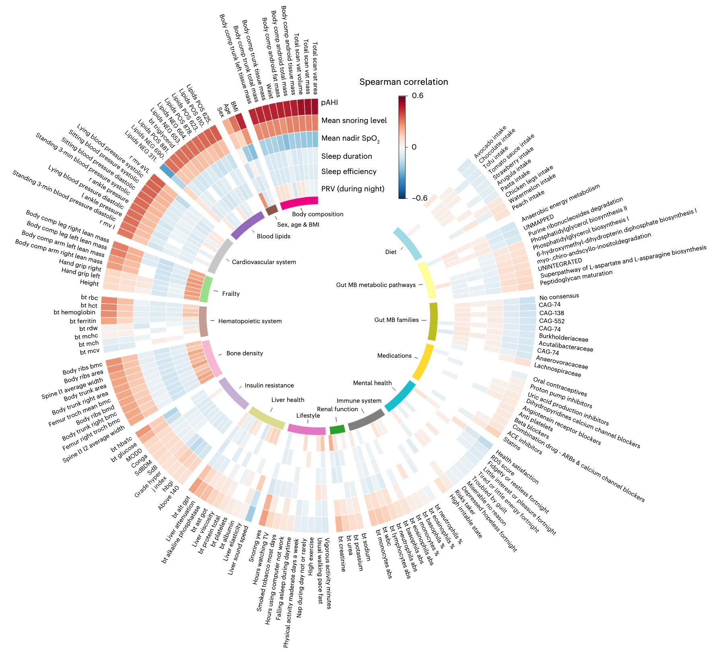

Kohn S, Diament A, Godneva A, Dhir R, Weinberger A, Reisner Y, Rossman H, Segal E, [*Nature Medicine*](https://doi.org/10.1038/s41591-024-03481-x)

## Paper Summary 

The paper demonstrates how multi-night, high-resolution sleep monitoring data from 6,366 individuals over 16,812 nights from the Human Phenotype Project (HPP) can predict health outcomes across multiple body systems. The study showcases the potential of wearable devices as tools for broad health insights. The study highlights HPP's unique combination of multi-modal phenotypic data to advance disease risk prediction and personalized health solutions.

Key findings demonstrate that sleep features are powerful predictors of metabolic, cardiovascular, and mental health outcomes, outperforming traditional metrics in some cases. The predictive models developed in this study offer new opportunities for clinical trial optimization, remote monitoring solutions, and personalized health insights.

**Key findings and numbers:**

- Multi-modal disease prediction: Sleep traits predicted over 15% of body system traits across 15 of 16 systems, including cardiovascular, metabolic, and even mental health, highlighting the cross-system predictive power of HPP data.

- Metabolic and cardiovascular risk: The study shows that sleep test measures predict insulin resistance traits and blood lipid levels with greater accuracy than traditional metrics. For example, visceral fat (VAT), a key metabolic risk factor, was strongly correlated with the peripheral Apnea-Hypopnea Index (pAHI) (Spearman ρ = 0.52).

- Longitudinal consistency: The model tracked sleep features over time in individuals, showing high consistency in key markers like oxygen saturation and snoring levels, making it a potential tool for long-term health monitoring.

- Mental health and lifestyle prediction: Sleep features predicted anxiety (AUC = 0.507 in males, 0.518 in females) and hyperlipidemia (AUC = 0.544 in males, 0.522 in females), beyond traditional metrics. Additionally, lifestyle factors explained over 50% of sleep test variability, highlighting the role of behavior in health outcomes.

- Medical diagnosis associations: The study identified sex-specific associations with various conditions, such as osteopenia, prediabetes, and hypertension in females, and allergy and back pain in males.

- The study shows the effects of menopause on sleep apnea related metrics, showing that menopause is a strong contributor to sleep apnea independent of age and suggests some of the female sex-specific associations relate to menopausal status.

These results demonstrate the potential of sleep monitoring as a comprehensive health assessment tool. Sleep features could be used to identify at-risk individuals earlier, forecast clinical trial outcomes, and enable personalized interventions in chronic conditions like diabetes, cardiovascular disease, and sleep apnea.

This work paves the way for developing AI-based models using multi-night sleep data to improve health forecasting and preventative care across various medical domains. The HPP dataset provides unique value for commercial partners looking to integrate multi-modal health data and wearable devices into clinical research and digital health solutions.

