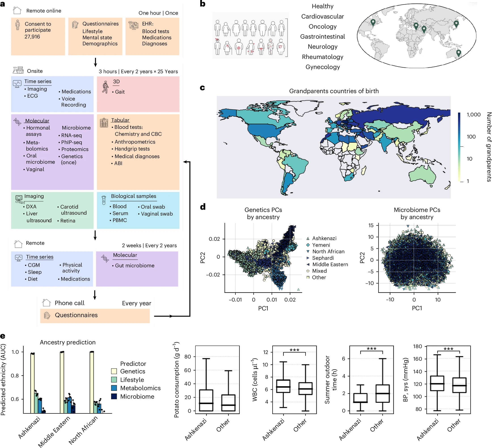

Reicher L, Shilo S, Godneva A, Lutsker G, Zahavi L, Shoer S, Krongauz D, Rein M, Kohn S, Segev T, Schlesinger Y, Barak D, Levine Z, Keshet A, Shaulitch R, Lotan-Pompan M, Elkan M, Talmor-Barkan Y, Aviv Y, Dadiani M, Tsodyks Y, Gal-Yam E, Leibovitzh H, Werner L, Tzadok R, Maharshak N, Koga S, Glick-Gorman Y, Stossel C, Raitses-Gurevich M, Golan T, Dhir R, Reisner Y, Weinberger A, Rossman H, Song L, Xing E, Segal E, [*Nature
Medicine*](https://doi.org/10.1038/s41591-025-03790-9)

## Paper summary

The Human Phenotype Project (HPP) is a large-scale deep-phenotype prospective cohort. To date, approximately 28,000 participants have enrolled, with more than 13,000 completing their initial visit. The project is aimed at identifying novel molecular signatures with diagnostic, prognostic and therapeutic value, and at developing artificial intelligence (AI)-based predictive models for disease onset and progression. The HPP includes longitudinal profiling encompassing medical history, lifestyle and nutrition, anthropometrics, blood tests, continuous glucose and sleep monitoring, imaging and multi-omics data, including genetics, transcriptomics, microbiome (gut, vaginal and oral), metabolomics and immune profiling. Analysis of these data highlights the variation of phenotypes with age and ethnicity and unravels molecular signatures of disease by comparison with matched healthy controls. Leveraging extensive dietary and lifestyle data, we identify associations between lifestyle factors and health outcomes. Finally, we present a multi-modal foundation AI model, trained using self-supervised learning on diet and continuous-glucose-monitoring data, that outperforms existing methods in predicting disease onset. This framework can be extended to integrate other modalities and act as a personalized digital twin. In summary, we present a deeply phenotyped cohort that serves as a platform for advancing biomarker discovery, enabling the development of multi-modal AI models and personalized medicine approaches.

