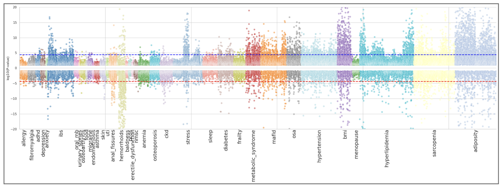

Weissglas-Volkov D, Reisner Y, Shor T, Diament A, Jankelow A, Godneva A, Napier B, Dhir R, Segal E, [*BioRxiv*](https://doi.org/10.1101/2025.06.26.661672)

## Paper summary

The human gut microbiome is increasingly implicated with diverse health conditions,
highlighting the importance of developing comprehensive resources to systematically map
these associations. In this study, we leveraged the Human Phenotype Project (HPP) 10K cohort,
a large, deeply phenotyped population study cohort with extensive metagenomic profiling, to
explore associations between the gut microbiome and 37 health indications. These include
conditions with established or emerging links to the microbiome, such as obesity, diabetes,
hyperlipidemia, metabolic syndrome, inflammation, liver disease, cardiovascular and kidney
conditions, immune and allergic diseases, gastrointestinal symptoms, mental health, and
sleep-related traits. Using a curated set of approximately 200 refined phenotypic features and
analyzing 1,184 microbial species, we performed robust statistical association analyses. We
observed significant enrichment of associations in 14 health indications, with most associations
reflecting increased microbial abundance in favorable health states, thereby suggesting
potential microbial targets for intervention. This work introduces a publicly available,
high-resolution resource to facilitate future research and support the development of
microbiome-informed health strategies.

The inverted Manhattan plot below displays the log-transformed p-values for associations between microbiome features and multiple health indications. Each point represents a microbial species, with colors indicating different health indication categories.

 