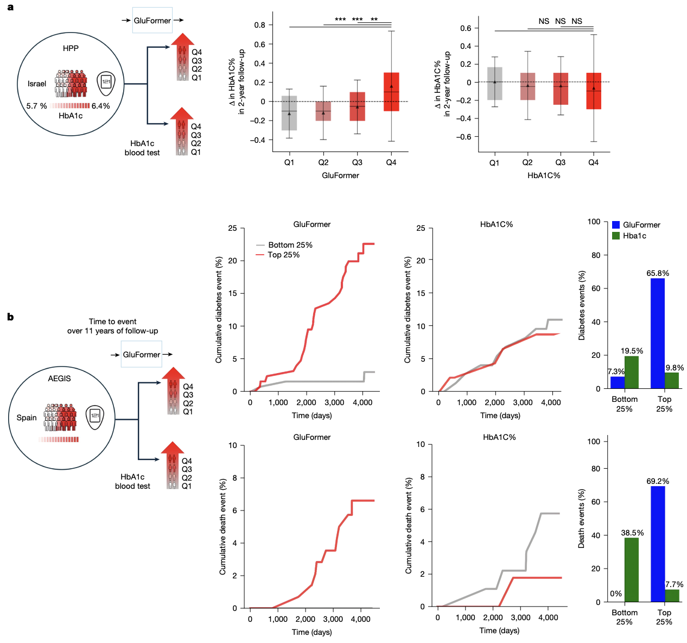

Lutsker G, Sapir G, Shilo S, Merino J, Godneva A, Greenfield J, Samocha-Bonet D, Dhir R, Gude F, Mannor S, Meirom E, Xing E, Chechik G, Rossman H, Segal E, [*Nature*](https://www.nature.com/articles/s41586-025-09925-9)

## Paper summary

Continuous glucose monitoring (CGM) provides high-resolution measurements of glucose dynamics, yet clinical assessment of glycaemic status still relies heavily on laboratory biomarkers such as HbA1c and on a limited set of handcrafted CGM-derived summary metrics. In this study, we introduce **GluFormer**, a transformer-based foundation model trained using self-supervised learning on more than 10 million CGM measurements from 10,812 adults in the Human Phenotype Project (HPP), the majority of whom did not have diabetes. By learning to autoregressively predict future glucose values from discretized CGM time series, the model captures latent representations of glycaemic physiology directly from raw CGM data.

We evaluated GluFormer across 19 external cohorts spanning five countries, eight CGM devices, and a wide range of metabolic and clinical contexts, including prediabetes, type 1 and type 2 diabetes, gestational diabetes, obesity, and multiple clinical trial populations. Across these settings, GluFormer-derived representations consistently improved prediction of contemporaneous and future glycaemic measures compared with standard CGM-derived metrics such as GMI, time-in-range, and glycaemic variability. In individuals with prediabetes, the model stratified two-year HbA1c trajectories more effectively than baseline HbA1c, identifying individuals at risk of glycaemic deterioration despite similar initial laboratory measurements.

In an independent population-based cohort with a median follow-up of 11 years, GluFormer embeddings were strongly associated with long-term clinical outcomes. The majority of incident diabetes cases and cardiovascular deaths occurred among individuals in the highest risk quartile defined by the model, whereas baseline HbA1c did not meaningfully stratify risk. These findings indicate that dynamic CGM patterns encode prognostic information that is not captured by static glycaemic biomarkers.

Beyond outcome prediction, GluFormer accurately generated physiologically realistic CGM trajectories, reproducing key clinical glucose metrics across diverse populations, disease states, and devices. A multimodal extension of the model that integrates dietary information further improved prediction of postprandial glucose responses, demonstrating the potential of combining behavioral and physiological data within a unified foundation modeling framework. Together, this work establishes CGM-based foundation models as a scalable approach for extracting clinically relevant representations of metabolic health, with potential applications in early risk stratification, long-term outcome prediction, and precision medicine.

