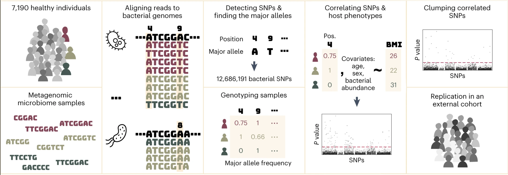

Zahavi L, Lavon A, Reicher L, Shoer S, Godneva A, Leviatan S, Rein M, Weissbrod O, Weinberger A, Segal E, [*Nature Medicine*](http://dx.doi.org/10.1038/s41591-023-02599-8)

## Paper summary

Genome-wide association studies (GWASs) have provided numerous associations between human single-nucleotide polymorphisms (SNPs) and health traits. Likewise, metagenome-wide association studies (MWASs) between bacterial SNPs and human traits can suggest mechanistic links, but very few such studies have been done thus far. In this study, we devised an MWAS framework to detect SNPs and associate them with host phenotypes systematically. We recruited and obtained gut metagenomic samples from a cohort of 7,190 healthy individuals and discovered 1,358 statistically significant associations between a bacterial SNP and host body mass index (BMI), from which we distilled 40 independent associations. Most of these associations were unexplained by diet, medications or physical exercise, and 17 replicated in a geographically independent cohort. We uncovered BMI-associated SNPs in 27 bacterial species, and 12 of them showed no association by standard relative abundance analysis. We revealed a BMI association of an SNP in a potentially inflammatory pathway of *Bilophila wadsworthia* as well as of a group of SNPs in a region coding for energy metabolism functions in a *Faecalibacterium prausnitzii* genome. Our results demonstrate the importance of considering nucleotide-level diversity in microbiome studies and pave the way toward improved understanding of interpersonal microbiome differences and their potential health implications.

