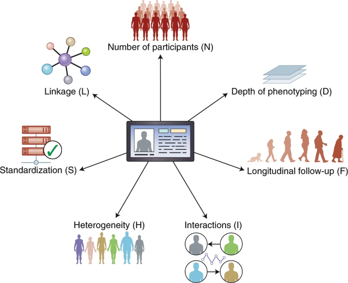

Shilo S, Rossman H, Segal E, [*Nature Medicine*](http://dx.doi.org/10.1038/s41591-019-0727-5)

## Paper summary

Health data are increasingly being generated at a massive scale, at various levels of phenotyping and from different types of resources. Concurrent with recent technological advances in both data-generation infrastructure and data-analysis methodologies, there have been many claims that these events will revolutionize healthcare, but such claims are still a matter of debate. Addressing the potential and challenges of big data in healthcare requires an understanding of the characteristics of the data. Here we characterize various properties of medical data, which we refer to as ‘axes’ of data, describe the considerations and tradeoffs taken when such data are generated, and the types of analyses that may achieve the tasks at hand. We then broadly describe the potential and challenges of using big data in healthcare resources, aiming to contribute to the ongoing discussion of the potential of big data resources to advance the understanding of health and disease.

