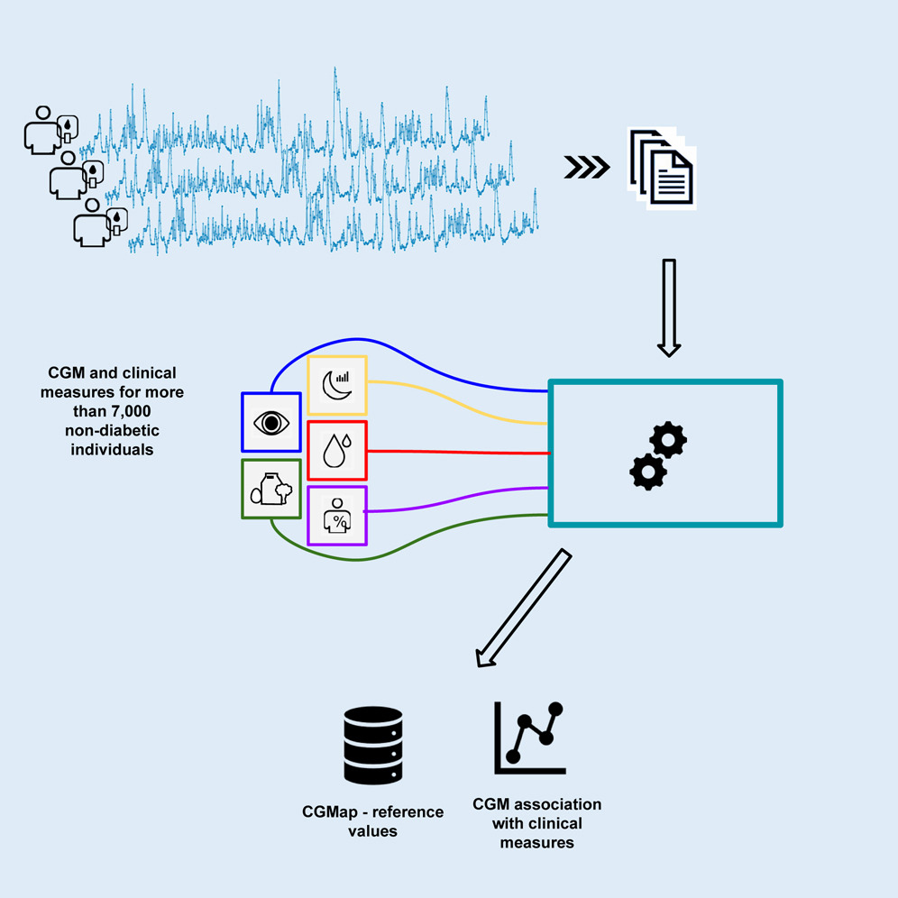

Keshet A, Shilo S, Godneva A, Talmor-Barkan Y, Aviv Y, Segal E, Rossman H, [*Cell Metabolism*](http://dx.doi.org/10.1016/j.cmet.2023.04.002)

## Paper summary

Despite its rising prevalence, diabetes diagnosis still relies on measures from blood tests. Technological advances in continuous glucose monitoring (CGM) devices introduce a potential tool to expand our understanding of glucose control and variability in people with and without diabetes. Yet CGM data have not been characterized in large-scale healthy cohorts, creating a lack of reference for CGM data research. Here we present CGMap, a characterization of CGM data collected from over 7,000 non-diabetic individuals, aged 40–70 years, between 2019 and 2022. We provide reference values of key CGM-derived clinical measures that can serve as a tool for future CGM research. We further explored the relationship between CGM-derived measures and diabetes-related clinical parameters, uncovering several significant relationships, including associations of mean blood glucose with measures from fundus imaging and sleep monitoring. These findings offer novel research directions for understanding the influence of glucose levels on various aspects of human health.

